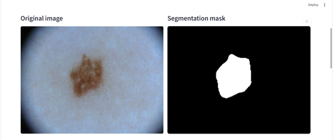
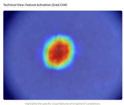
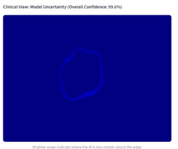
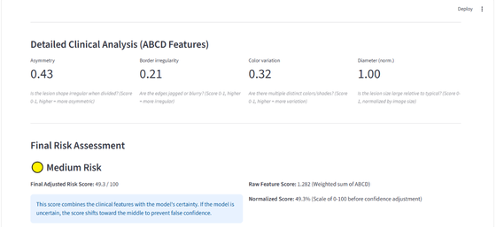
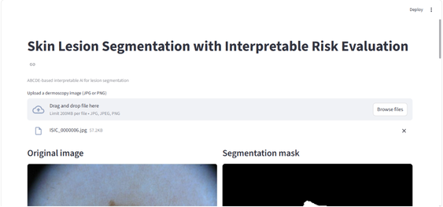

# Skin Lesion Segmentation with Interpretable Risk Evaluation using Clinical Feature Analysis

A medical AI web application for **skin lesion segmentation and interpretable risk evaluation**, combining a CNN–ViT hybrid deep learning model with clinical feature analysis and model explainability techniques.

## Overview

This project presents an AI-based approach for analyzing dermoscopic skin lesion images. The system performs lesion segmentation using a **CNN–ViT hybrid architecture** and provides additional interpretability through **Grad-CAM**, **Monte-Carlo uncertainty estimation**, and **ABCD clinical feature analysis**.

**The system combines deep-learning-based lesion segmentation with model explainability, uncertainty estimation, and ABCD-based clinical feature analysis to provide an interpretable risk assessment.**

The application is designed as a web-based interface that allows users to obtain segmentation results together with interpretable information about the model's predictions.

## Key Features

* **Skin lesion segmentation** using a CNN–ViT hybrid deep learning model
* **Clinical feature analysis** based on ABCD criteria
* **Grad-CAM explainability** for visual interpretation of model attention
* **Monte-Carlo uncertainty estimation** to quantify prediction uncertainty
* **Risk evaluation** based on extracted clinical characteristics
* Web-based interface for interacting with the trained model
* Evaluation using multiple segmentation performance metrics

## Methodology

The system combines deep learning-based image segmentation with model explainability, uncertainty estimation, and interpretable clinical analysis.

### 1. Image Preprocessing

Input dermoscopic images are preprocessed before being provided to the segmentation model.

### 2. CNN–ViT Hybrid Segmentation

A hybrid architecture combining **Convolutional Neural Network (CNN)** components with a **Vision Transformer (ViT)** is used to identify and segment the lesion region.

### 3. Explainability

**Grad-CAM** is incorporated to provide visual explanations of the regions contributing to the model's prediction.

### 4. Uncertainty Estimation

**Monte-Carlo sampling** is used to estimate predictive uncertainty, providing an indication of the uncertainty associated with model outputs.

### 5. Clinical Feature Analysis

The segmented lesion is further analyzed using ABCD-related characteristics:

* **A — Asymmetry**
* **B — Border**
* **C — Color**
* **D — Diameter**

These features are incorporated into the risk evaluation component to provide an interpretable clinical perspective alongside the model output.

## Dataset

The project uses the **ISIC 2018 dataset** for skin lesion image analysis and segmentation.

The dataset is **not included in this repository** because of its large size. Users should obtain the dataset separately according to the applicable dataset terms and place the required images and masks in the expected project directories.

Expected local structure:

```text
data/
├── images/
└── masks/
```

The dataset-related directories are excluded from Git tracking through `.gitignore`.

## Results and Outputs

The segmentation model was evaluated using a threshold of **0.45**.

| Metric          | Result |
| --------------- | -----: |
| Best Threshold  |   0.45 |
| Accuracy        | 95.03% |
| Precision       | 91.08% |
| Recall          | 90.79% |
| F1 Score        | 90.93% |
| Specificity     | 96.64% |
| Mean IoU        | 83.74% |
| Mean Dice Score | 90.19% |

### Confusion Matrix Counts

```text
TP = 6,477,837
FP =   634,333
FN =   657,364
TN = 18,221,634
```

These results represent the evaluated segmentation performance on the project's evaluation data.

### Application Outputs

The web application provides:

- Original dermoscopic image
- Predicted lesion segmentation
- Grad-CAM visualization
- Uncertainty estimation
- Extracted ABCD clinical characteristics
- Interpretable risk evaluation score

#### Skin Lesion Segmentation



#### Grad-CAM Visualization



#### Uncertainty Estimation



#### ABCD Clinical Feature Analysis



#### Web Application



## Project Structure

```text
skin-lesion-segmentation-evaluation/
│
├── data/
│   └──                         # Dataset (excluded from Git)
│
├── models/
│   ├── best_iou.txt            # Best IoU result
│   ├── best_model.pth          # Trained model weights
│   └── eval_metrics.txt        # Evaluation metrics
│
├── modules/
│   ├── __init__.py
│   ├── abcd_features.py        # ABCD clinical feature analysis
│   ├── explainability.py       # Grad-CAM explainability
│   ├── model.py                # Model architecture
│   ├── preprocess.py           # Image preprocessing
│   ├── report.py               # Report generation
│   ├── risk_eval.py            # Risk evaluation
│   └── uncertainty.py          # Uncertainty estimation
│
├── app.py                      # Web application
├── train.py                    # Model training
├── evaluate.py                 # Model evaluation
├── requirements.txt            # Python dependencies
└── .gitignore                  # Files excluded from Git
```

## Technologies

* **Python**
* **PyTorch**
* **Torchvision**
* **Albumentations**
* **OpenCV**
* **NumPy**
* **Scikit-learn**
* **Scikit-image**
* **Matplotlib**
* **Grad-CAM**
* **Streamlit**
* **timm**

## Installation

### 1. Clone the repository

```bash
git clone https://github.com/neha-roy-049/skin-lesion-segmentation-evaluation.git
cd skin-lesion-segmentation-evaluation
```

### 2. Create a virtual environment

```bash
python -m venv skin_lesion_env
```

Activate it on Windows:

```bash
skin_lesion_env\Scripts\activate
```

### 3. Install dependencies

```bash
pip install -r requirements.txt
```

### 4. Add the dataset

Obtain the required **ISIC 2018 dataset** separately and place the images and corresponding masks in:

```text
data/images/
data/masks/
```

### 5. Run the application

```bash
streamlit run app.py
```

The application will start locally and provide a URL through which the web interface can be accessed.

## Model

The trained model weights are provided in:

```text
models/best_model.pth
```

The application can use the trained weights without requiring the model to be retrained.

## Team

This project was developed as a team project by:

* **Anjana R**
* **Anupama Abraham George**
* **Malavika A**
* **Neha Roy**

## Disclaimer

This project is intended for **academic and research purposes**. The outputs of the system should not be considered a medical diagnosis or a substitute for evaluation by a qualified healthcare professional.

The system is designed to demonstrate the application of artificial intelligence, computer vision, model explainability, uncertainty estimation, and clinical feature analysis for skin lesion assessment.

The project does not claim to provide clinically validated medical diagnosis or treatment recommendations.

## License

The project source code and associated materials are provided for **academic and educational use**. Dataset usage is subject to the terms and license of the original **ISIC 2018 dataset**.
